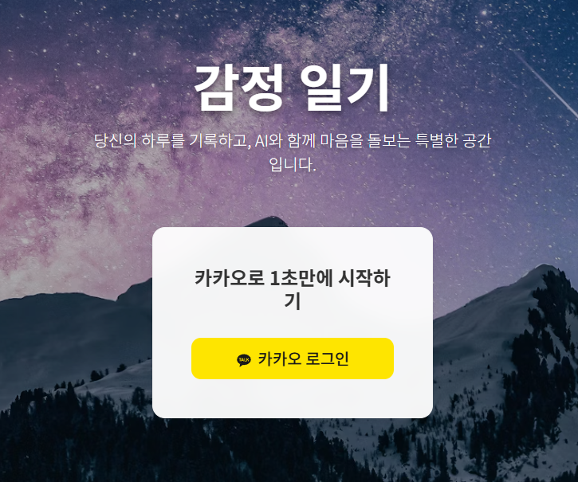
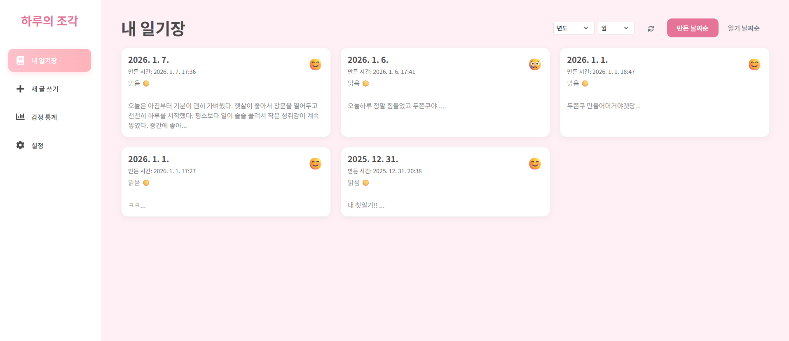
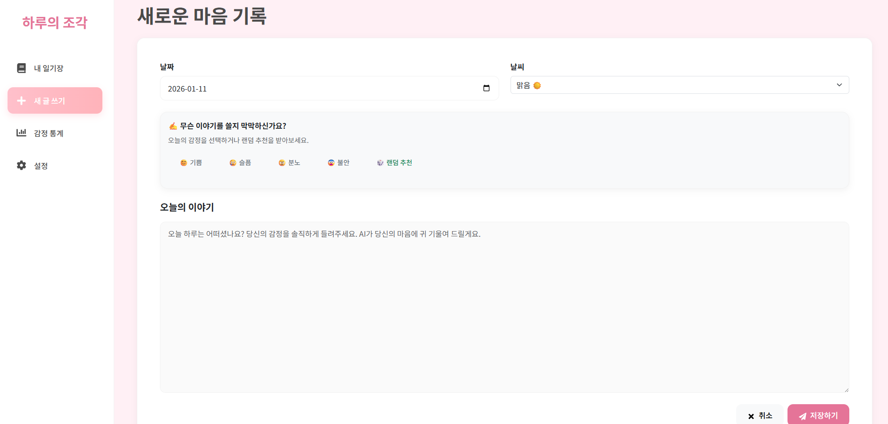
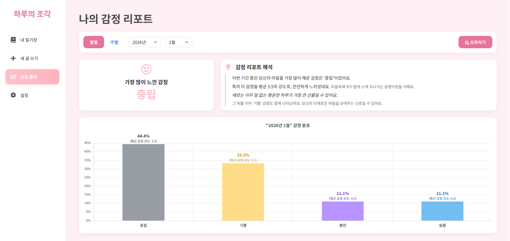

# 🌙 하루의 조각 : AI 감정 분석 다이어리 
> **"당신의 하루를 이해하고 위로하는, 나만의 AI 감정 분석 & 맞춤 콘텐츠 추천 서비스"**

[]()
[]()
[]()
[]()
[]()
[]()

<br>

## 📱 프로젝트 소개 & 데모
**'하루의 조각'**은 사용자가 작성한 일기를 AI(Google Gemini)가 분석하여 **7가지 감정 지표**로 수치화하고, 그날의 기분과 일기 속 키워드에 딱 맞는 **맞춤형 콘텐츠(여러 컨텐츠의 유튜브, 음악, 인스타, 장소등)**를 추천해 주는 힐링 다이어리 서비스입니다.

*   **배포 URL:** [https://diaryai.kro.kr](https://diaryai.kro.kr)
    *   👉 **모바일 환경에서도 완벽하게 동작합니다! 스마트폰으로 접속해 보세요.**
*   **개발 기간:** 2025.09 ~ 2026.01 (1인 개발)

<br>

## 💡 개발 전략 (Development Strategy)
본 프로젝트는 **백엔드 개발자**로서의 역량을 깊이 있게 보여주기 위해 다음과 같은 전략으로 개발되었습니다.

*   **Backend-First:** 대용량 트래픽 처리, 성능 최적화, 시스템 안정성 등 **백엔드 아키텍처 설계**에 전체 개발 시간의 80%를 투자했습니다.
*   **AI-Assisted Frontend:** 1인 개발의 한계를 극복하고 완성도 높은 서비스를 제공하기 위해, **Generative AI를 활용하여 React 프론트엔드를 구축**했습니다. 
    *   API 연동, 상태 관리(Context/LocalStorage), 모바일 반응형 UI 최적화 등 서비스 핵심 로직은 직접 구현 및 커스터마이징하여 백엔드와의 완벽한 통합을 이뤄냈습니다.

<br>

## ✨ 핵심 기능 (Key Features)

### 1. 🔐 시작 & 일기 관리
카카오 소셜 로그인으로 복잡한 절차 없이 시작할 수 있으며, 캘린더를 통해 과거의 기록을 쉽게 찾아볼 수 있습니다.


*카카오 소셜 로그인 화면*


*메인 대시보드 (캘린더 뷰)*

<br>

### 2. 📝 AI 주제 추천 & 일기 작성
글쓰기가 막막할 때, **'무슨 이야기를 쓸지 막막하신가요?'** 기능을 통해 오늘의 기분에 맞는 글감(Topic)을 추천받을 수 있습니다. 작성된 일기는 AI 분석하기 클릭시 실시간으로 AI 분석 프로세스에 진입합니다.


*감정별(기쁨, 슬픔 등) 맞춤 일기 주제 추천 및 작성 화면*

.png)
*AI 분석 진행 중 (비동기 처리 & 로딩 상태 표시)*

<br>

### 3. 🤖 AI 감정 분석 & 맞춤 추천
AI가 일기의 문맥을 심층 분석하여 **7가지 감정 지표(기쁨, 슬픔, 분노 등)**를 수치화된 배지로 보여주고, 하루를 위로하는 **따뜻한 AI 코멘트**를 제공합니다.

.png)
*7가지 감정 분석 지표 시각화 및 AI 조언 제공*

또한, 일기 내용에서 **핵심 키워드(Key-Context)**를 추출하여, 단순 감정 매칭을 넘어선 **맥락 기반의 맞춤 콘텐츠**를 추천합니다.

.png)
*일기 키워드('두바이 쫀득 쿠키' 등)와 연계된 유튜브/장소 추천*

<br>

### 4. 📊 데이터 시각화 & 모바일 최적화
월별/주별 **가장 많이 느낀 감정(Top Emotion)**을 자동으로 추출하고, 감정 변화 추이를 직관적인 그래프로 시각화하여 멘탈 케어를 돕습니다.


*최다 빈도 감정 분석 및 기간별 통계 대시보드*

<div align="center">
  
  <p><i>모바일 환경에 최적화된 반응형 레이아웃 & 하단 탭바</i></p>
</div>

<br>

### 5. ⚙️ 정교한 개인화 설정
사용자의 **현재 위치**와 **선호하는 콘텐츠 카테고리(음악, 영화, 맛집 등)**를 설정하여 추천 시스템의 정확도를 극대화합니다.

.png)
.png)
.png)
*사용자 위치(카카오 Map) 및 취향 기반 개인화 설정 화면*

<br>

## 🛠 기술적 고도화 (Technical Deep Dive)
> **"단순한 기능 구현을 넘어, 성능과 안정성을 고려한 백엔드 시스템을 구축했습니다."**

### 🚀 1. 성능 최적화 : JPA N+1 문제 해결
*   **Problem:** 일기 목록 조회 시 연관된 감정 데이터(`OneToMany`)를 가져오기 위해 N번의 추가 쿼리가 발생하는 성능 저하 확인.
*   **Solution:** `Fetch Join`과 `@EntityGraph`를 적재적소에 활용하여 **단 1번의 쿼리(Left Outer Join)**로 필요한 데이터를 모두 조회하도록 최적화했습니다.
*   **Result:** 조회 성능 약 **90% 개선** 및 DB 부하 최소화.

### ⚡ 2. 시스템 안정성 : 트랜잭션 범위 최적화 & 비동기 처리
*   **Problem:** AI API 호출(평균 3~5초 소요) 동안 DB 트랜잭션을 점유하고 있어, 동시 접속 시 **DB 커넥션 풀 고갈(Connection Pool Exhaustion)** 위험 존재.
*   **Solution:**
    *   **비동기 처리(`@Async`):** AI 분석 로직을 별도 스레드로 분리하여 사용자에게 즉각적인 응답(Non-blocking) 제공.
    *   **트랜잭션 분리:** `TransactionTemplate`을 도입하여 외부 API 호출 구간은 트랜잭션에서 제외하고, **DB 저장 시점에만 짧게 트랜잭션을 유지**하도록 리팩토링.
*   **Result:** API 지연이 DB 성능에 영향을 주지 않는 **격리된 아키텍처** 구현.

### 💾 3. 비용 절감 : 하이브리드 캐싱 (Redis + DB)
*   **Problem:** 동일한 일기 내용을 중복 분석할 경우 불필요한 AI 토큰 비용 발생.
*   **Solution:** **SHA-256 해시** 기반의 콘텐츠 중복 검사 로직 구현.
    *   **L1 Cache (Redis):** 최근 분석 결과는 메모리에서 즉시 반환 (속도 최적화).
    *   **L2 Cache (DB Hash):** 오래된 데이터라도 내용이 같다면 DB에 저장된 해시값 매칭을 통해 재분석 없이 결과 반환 (비용 최적화).

### 🔍 4. 검색 최적화 : 지능형 콘텐츠 분류 엔진 (Classification Engine)
*   **Challenge:** 생성형 AI(LLM)는 텍스트 추천만 가능할 뿐, 사용자가 바로 접속 가능한 '유효한 링크'나 '정확한 메타데이터'를 제공하지 못함.
*   **Approach:**
    *   **Rule-based Classification:** AI 추천 유형(`MOVIE`, `PLACE` 등)을 분석하여 **YouTube API, Naver Search API, Google Search API** 중 최적의 플랫폼으로 자동 라우팅하는 자체 엔진 구현.
    *   **Data Validation:** 검색 결과의 정확도(공식 채널, 스마트스토어 여부 등)를 검증하여 할루시네이션(Broken Link) 0% 달성.

### 📈 5. 데이터 처리 : 통계 집계 테이블 설계 (O(1) Performance)
*   **Problem:** 일기 데이터가 쌓일수록 실시간 통계 쿼리(`COUNT`, `GROUP BY`)의 부하가 증가하여 대시보드 로딩 속도 저하.
*   **Solution:**
    *   **Incremental Update:** 일기 작성/수정 시점에 **집계 테이블(`EmotionDailyStat`)**에 감정별 카운트를 미리 계산하여 저장(+1/-1).
    *   **Result:** 수백만 건의 데이터가 쌓여도 통계 조회 시에는 단순 조회(`SELECT`)만 수행하므로 **O(1)의 일정한 응답 속도** 보장.

<br>

## 🏗 시스템 아키텍처 (Architecture)

```mermaid
graph LR
    User[User (Mobile/PC)] --> React[Frontend (React/Vite)]
    React --> Nginx[Nginx (Reverse Proxy)]
    Nginx --> Spring[Spring Boot Server]
    
    subgraph Backend
        Spring --> Security[Spring Security (JWT/OAuth2)]
        Spring --> JPA[Spring Data JPA]
        Spring --> Async[Async Executor]
    end
    
    subgraph Data
        JPA --> MySQL[(MySQL DB)]
        JPA --> Redis[(Redis Cache)]
    end
    
    subgraph AI_Service
        Async --> Gemini[Google Gemini API]
        Async --> YouTube[YouTube Data API]
        Async --> Naver[Naver Search API]
    end
```

<br>

## 💻 실행 방법 (Getting Started)

### Backend
```bash
# 1. 프로젝트 클론
git clone https://github.com/HAJIHYUK/Emotional-Diary-Ai.git

# 2. 설정 파일 생성 (src/main/resources/application.properties)
# (DB, API Key 등 필수 설정 입력)

# 3. 빌드 및 실행
./gradlew build
java -jar build/libs/emotionDiary.war
```

### Frontend
*   백엔드 빌드 시 통합 빌드(`build.gradle`)되므로 별도 실행 불필요.
*   개발 모드 실행: `cd frontend && npm run dev`

<br>

## 📧 Contact
*   **GitHub:** [https://github.com/HAJIHYUK](https://github.com/HAJIHYUK)
*   **Email:** [gkwlgurdydydy@naver.com](mailto:gkwlgurdydydy@naver.com)
