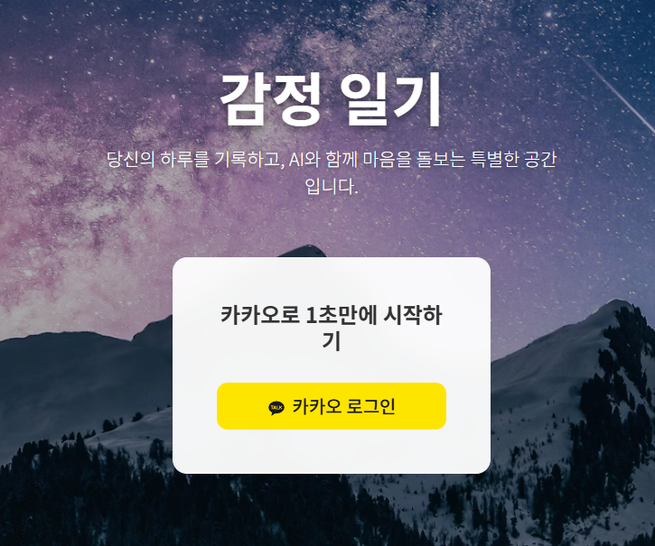
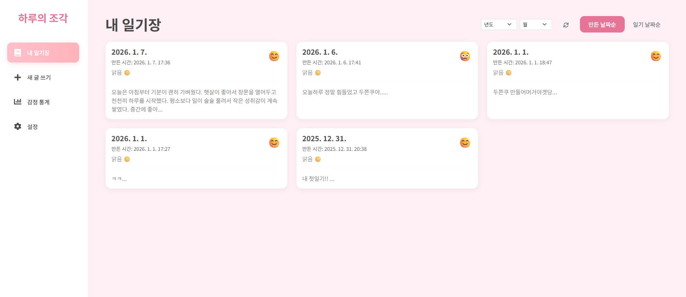
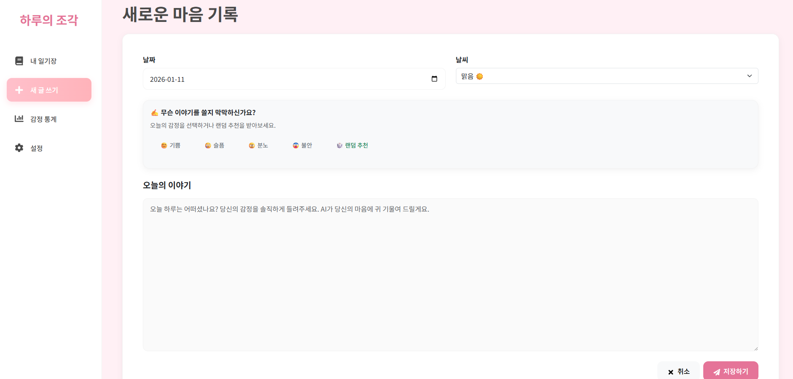
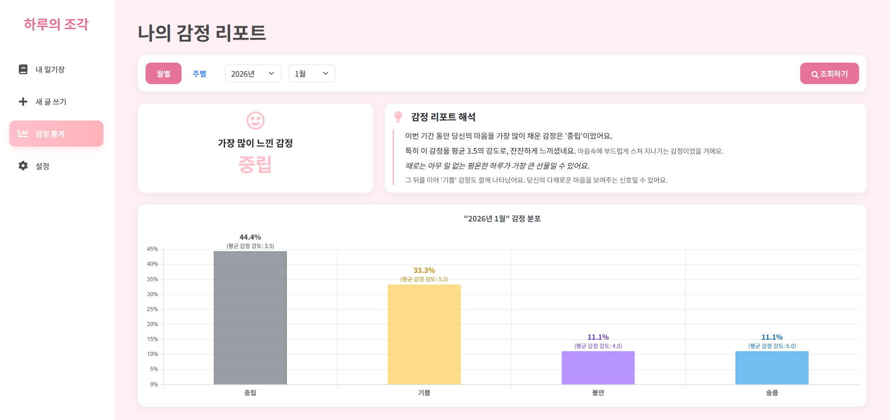
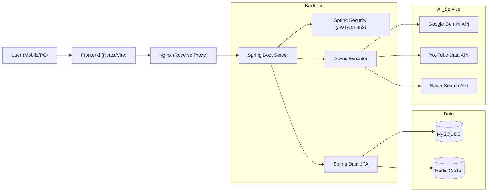

# 🌙 하루의 조각 : AI 감정 분석 다이어리 
> **"당신의 하루를 이해하고 위로하는, 나만의 AI 감정 분석 & 맞춤 콘텐츠 추천 서비스"**

[]()
[]()
[]()
[]()
[]()
[]()

<br>

> 🚨 **잠깐만요! 코드를 보시기 전에 꼭 읽어주세요.** 
> 이 프로젝트는 제가 백엔드 개발을 처음 본격적으로 공부하며 완성했던 초기 프로젝트입니다. 
> 지금 다시 보니 부족한 점(객체지향 설계, 아키텍처 등)이 너무 많이 보여서 부끄럽기도 하지만, 그대로 남겨두었습니다.
> 코드를 보시기 전에 하단의 **[💡 프로젝트 회고 및 리팩토링 계획](#-프로젝트-회고-및-리팩토링-계획)**을 먼저 읽어주시면 제가 그동안 어떻게 성장했는지 파악하시는 데 도움이 될 것 같습니다!

<br>

## 📱 프로젝트 소개 & 데모
**'하루의 조각'** 은 사용자가 작성한 일기를 AI(Google Gemini)가 분석하여 **7가지 감정 지표**로 수치화하고, 그날의 기분과 일기 속 키워드에 딱 맞는 **맞춤형 콘텐츠(여러 컨텐츠의 유튜브, 음악, 인스타, 장소등)** 를 추천해 주는 힐링 다이어리 서비스입니다.

*   **배포 상태:** 🚧 현재는 서버 유지비용 문제로 운영을 임시 중단했습니다. (하단의 `실행 방법`을 통해 로컬에서 구동해보실 수 있습니다.)
*   **개발 기간:** 2025.09 ~ 2026.01 (1인 개발)

<br>

## 💡 개발 전략 (Development Strategy)
본 프로젝트는 **백엔드 개발자**로서의 역량을 깊이 있게 보여주기 위해 다음과 같은 전략으로 개발되었습니다.

*   **Backend-First:** 대용량 트래픽 처리, 성능 최적화, 시스템 안정성 등 **백엔드 아키텍처 설계**에 전체 개발 시간의 80%를 투자했습니다.
*   **AI-Assisted Frontend:** 1인 개발의 한계를 극복하고 완성도 높은 서비스를 제공하기 위해, **Generative AI를 활용하여 React 프론트엔드를 구축**했습니다. 
    *   API 연동, 상태 관리(Context/LocalStorage), 모바일 반응형 UI 최적화 등 서비스 핵심 로직은 직접 구현 및 커스터마이징하여 백엔드와의 완벽한 통합을 이뤄냈습니다.

<br>

## ✨ 핵심 기능 (Key Features)

### 1. 🔐 시작 & 일기 관리
카카오 소셜 로그인으로 복잡한 절차 없이 시작할 수 있으며, 캘린더를 통해 과거의 기록을 쉽게 찾아볼 수 있습니다.


*카카오 소셜 로그인 화면*


*메인 대시보드 (캘린더 뷰)*

<br>

### 2. 📝 AI 주제 추천 & 일기 작성
글쓰기가 막막할 때, **'무슨 이야기를 쓸지 막막하신가요?'** 기능을 통해 오늘의 기분에 맞는 글감(Topic)을 추천받을 수 있습니다. 작성된 일기는 AI 분석하기 클릭시 실시간으로 AI 분석 프로세스에 진입합니다.


*감정별(기쁨, 슬픔 등) 맞춤 일기 주제 추천 및 작성 화면*

.png)
*AI 분석 진행 중 (비동기 처리 & 로딩 상태 표시)*

<br>

### 3. 🤖 AI 감정 분석 & 맞춤 추천
AI가 일기의 문맥을 심층 분석하여 **7가지 감정 지표(기쁨, 슬픔, 분노 등)** 를 수치화된 배지로 보여주고, 하루를 위로하는 **따뜻한 AI 코멘트**를 제공합니다.

.png)
*7가지 감정 분석 지표 시각화 및 AI 조언 제공*

또한, 일기 내용에서 **핵심 키워드(Key-Context)** 를 추출하여, 단순 감정 매칭을 넘어선 **맥락 기반의 맞춤 콘텐츠**를 추천합니다.

.png)
*일기 키워드('두바이 쫀득 쿠키' 등)와 연계된 유튜브/장소 추천*

<br>

### 4. 📊 데이터 시각화 & 모바일 최적화
월별/주별 **가장 많이 느낀 감정(Top Emotion)** 을 자동으로 추출하고, 감정 변화 추이를 직관적인 그래프로 시각화하여 멘탈 케어를 돕습니다.


*최다 빈도 감정 분석 및 기간별 통계 대시보드*

<div align="center">
  
  <p><i>모바일 환경에 최적화된 반응형 레이아웃 & 하단 탭바</i></p>
</div>

<br>

### 5. ⚙️ 정교한 개인화 설정
사용자의 **현재 위치**와 **선호하는 콘텐츠 카테고리(음악, 영화, 맛집 등)** 를 설정하여 추천 시스템의 정확도를 극대화합니다.

.png)
.png)
.png)
*사용자 위치(카카오 Map) 및 취향 기반 개인화 설정 화면*

<br>

## 🛠 기술적 고도화 (Technical Deep Dive)
> **"단순한 기능 구현을 넘어, 성능과 안정성을 고려한 백엔드 시스템을 구축했습니다."**

### 🚀 1. 성능 최적화 : JPA N+1 문제 해결
*   **Problem:** 일기 목록 조회 시 연관된 감정 데이터(`OneToMany`)를 가져오기 위해 N번의 추가 쿼리가 발생하는 성능 저하 확인.
*   **Solution:** `Fetch Join`과 `@EntityGraph`를 적재적소에 활용하여 **단 1번의 쿼리(Left Outer Join)**로 필요한 데이터를 모두 조회하도록 최적화했습니다.
*   **Result:** 조회 성능 약 **90% 개선** 및 DB 부하 최소화.

### ⚡ 2. 시스템 안정성 : 트랜잭션 범위 최적화 & 비동기 처리
*   **Problem:** AI API 호출(평균 3~5초 소요) 동안 DB 트랜잭션을 점유하고 있어, 동시 접속 시 **DB 커넥션 풀 고갈(Connection Pool Exhaustion)** 위험 존재.
*   **Solution:**
    *   **비동기 처리(`@Async`):** AI 분석 로직을 별도 스레드로 분리하여 사용자에게 즉각적인 응답(Non-blocking) 제공.
    *   **트랜잭션 분리:** `TransactionTemplate`을 도입하여 외부 API 호출 구간은 트랜잭션에서 제외하고, **DB 저장 시점에만 짧게 트랜잭션을 유지**하도록 리팩토링.
*   **Result:** API 지연이 DB 성능에 영향을 주지 않는 **격리된 아키텍처** 구현.

### 💾 3. 비용 절감 : 하이브리드 캐싱 (Redis + DB)
*   **Problem:** 동일한 일기 내용을 중복 분석할 경우 불필요한 AI 토큰 비용 발생.
*   **Solution:** **SHA-256 해시** 기반의 콘텐츠 중복 검사 로직 구현.
    *   **L1 Cache (Redis):** 최근 분석 결과는 메모리에서 즉시 반환 (속도 최적화).
    *   **L2 Cache (DB Hash):** 오래된 데이터라도 내용이 같다면 DB에 저장된 해시값 매칭을 통해 재분석 없이 결과 반환 (비용 최적화).

### 🔍 4. 검색 최적화 : 지능형 콘텐츠 분류 엔진 (Classification Engine)
*   **Challenge:** 생성형 AI(LLM)는 텍스트 추천만 가능할 뿐, 사용자가 바로 접속 가능한 '유효한 링크'나 '정확한 메타데이터'를 제공하지 못함.
*   **Approach:**
    *   **Rule-based Classification:** AI 추천 유형(`MOVIE`, `PLACE` 등)을 분석하여 **YouTube API, Naver Search API, Google Search API** 중 최적의 플랫폼으로 자동 라우팅하는 자체 엔진 구현.
    *   **Data Validation:** 검색 결과의 정확도(공식 채널, 스마트스토어 여부 등)를 검증하여 할루시네이션(Broken Link) 0% 달성.

### 📈 5. 데이터 처리 : 통계 집계 테이블 설계 (O(1) Performance)
*   **Problem:** 일기 데이터가 쌓일수록 실시간 통계 쿼리(`COUNT`, `GROUP BY`)의 부하가 증가하여 대시보드 로딩 속도 저하.
*   **Solution:**
    *   **Incremental Update:** 일기 작성/수정 시점에 **집계 테이블(`EmotionDailyStat`)**에 감정별 카운트를 미리 계산하여 저장(+1/-1).
    *   **Result:** 수백만 건의 데이터가 쌓여도 통계 조회 시에는 단순 조회(`SELECT`)만 수행하므로 **O(1)의 일정한 응답 속도** 보장.

<br>

## 🏗 시스템 아키텍처 (Architecture)


```mermaid
graph LR
    User["User (Mobile/PC)"] --> React["Frontend (React/Vite)"]
    React --> Nginx["Nginx (Reverse Proxy)"]
    Nginx --> Spring["Spring Boot Server"]
    
    subgraph Backend
        Spring --> Security["Spring Security (JWT/OAuth2)"]
        Spring --> JPA["Spring Data JPA"]
        Spring --> Async["Async Executor"]
    end
    
    subgraph Data
        JPA --> MySQL[("MySQL DB")]
        JPA --> Redis[("Redis Cache")]
    end
    
    subgraph AI_Service
        Async --> Gemini["Google Gemini API"]
        Async --> YouTube["YouTube Data API"]
        Async --> Naver["Naver Search API"]
    end
```

<br>

<br>

## 💡 프로젝트 회고 및 리팩토링 계획

이 프로젝트는 제가 백엔드 개발에 입문하여 처음으로 완성해 본 포트폴리오입니다. 
이후 여러 개발 경험을 쌓으며 객체지향 설계와 아키텍처에 대해 더 깊이 고민하게 되었고, 지금 다시 이 코드를 보니 당시에는 미처 알지 못했던 많은 아쉬움들이 보입니다. 
단순히 코드를 엎고 새로 짜기보다는, 제가 어떤 부분에서 부족했는지 스스로 인지하고 앞으로 어떻게 리팩토링할 것인지 기록으로 남기고자 합니다.

### 1. 무분별한 Setter 사용과 빈약한 도메인 모델
*   **아쉬운 점:** `DiaryRecord` 같은 엔티티에 `@Setter`가 다 열려 있고, 정작 중요한 비즈니스 로직은 전부 `DiaryService`에 쏠려 있습니다. 엔티티가 단순히 데이터만 담는 껍데기 역할을 하고 있습니다.
*   **리팩토링 계획:** `@Setter`를 모두 없애고, 상태 변경이 필요할 때는 `updateContent()`처럼 의미 있는 엔티티 내부 메서드를 만들어 데이터를 보호하는 객체지향적인 코드로 개선할 예정입니다.

### 2. 너무 커져버린 Service 클래스 (SRP 위반)
*   **아쉬운 점:** `DiaryService` 하나에 CRUD는 물론 DTO 변환 로직까지 다 섞여 있어서 코드가 길고 복잡합니다. 역할 분리가 제대로 되지 않았습니다.
*   **리팩토링 계획:** 클래스 하나가 한 가지 일만 하도록 Use-Case(Handler) 단위로 잘게 쪼개어(예: `CreateDiaryHandler`), 단일 책임 원칙(SRP)을 지키는 구조로 변경하려고 합니다.

### 3. JPA 변경 감지(Dirty Checking) 활용 부족
*   **아쉬운 점:** `@Transactional` 안에서 엔티티를 수정했는데도 굳이 `repository.save()`를 명시적으로 다시 호출하는 코드가 있습니다. 영속성 컨텍스트를 제대로 이해하지 못하고 짰던 흔적입니다.
*   **리팩토링 계획:** 트랜잭션 내의 변경 감지 기능을 온전히 활용하여 불필요한 `save()` 호출을 걷어내고, JPA를 JPA답게 쓰도록 수정할 계획입니다.

### 4. 읽기와 쓰기 로직의 혼재
*   **아쉬운 점:** 데이터를 단순 조회만 하는 쿼리와 상태를 변경하는 명령이 명확히 구분되지 않고 한 서비스 안에 섞여 있습니다. DTO 변환도 서비스 단에서 일일이 반복문을 돌고 있습니다.
*   **리팩토링 계획:** CQRS 개념을 차용해 조회용 모델과 쓰기용 모델을 분리하고, 번거로운 매핑 작업은 MapStruct 같은 라이브러리에 위임하여 비즈니스 로직을 깔끔하게 유지할 것입니다.

### 5. 값 객체(Value Object) 활용 부재
*   **아쉬운 점:** 날씨나 해시값 같은 데이터들이 그냥 원시 타입(`String`)으로 엔티티에 흩어져 있어 관리가 어렵고 응집도가 떨어집니다.
*   **리팩토링 계획:** 서로 연관되고 비즈니스 규칙이 있는 필드들은 `@Embedded`를 활용해 불변 VO(Value Object)로 묶어서 객체의 응집도를 높일 생각입니다.

<br>

## 💻 실행 방법 (Getting Started)

### Backend
```bash
# 1. 프로젝트 클론
git clone https://github.com/HAJIHYUK/Emotional-Diary-Ai.git

# 2. 설정 파일 생성 (src/main/resources/application.properties)
# (DB, API Key 등 필수 설정 입력)

# 3. 빌드 및 실행
./gradlew build
java -jar build/libs/emotionDiary.war
```

### Frontend
*   백엔드 빌드 시 통합 빌드(`build.gradle`)되므로 별도 실행 불필요.
*   개발 모드 실행: `cd frontend && npm run dev`

<br>

## 📧 Contact
*   **GitHub:** [https://github.com/HAJIHYUK](https://github.com/HAJIHYUK)
*   **Email:** [gkwlgurdydydy@naver.com](mailto:gkwlgurdydydy@naver.com)
